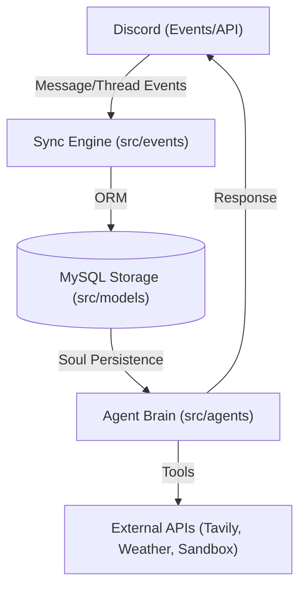

# Agent Development Guidelines for Dunya

This repository follows a strict workflow. All AI agents (including assistants and coding agents) must adhere to these guidelines to ensure consistency and avoid common errors.

## Development Workflow

- **Primary Branch**: `rolling`
- **Stable Branch**: `main`
- **PR Strategy**:
    - NEVER target `main` directly for features or refinements.
    - ALWAYS create a feature branch (e.g. `feat/lottie-sticker-support`) and target `rolling` as the base branch.
    - The repository follows a `rolling -> main` flow for deployments.
    - **Review Workflow**:
        - Once a PR is created, ALWAYS comment `/gemini review` in the GitHub PR after every commit.
        - If you disagree with a review, ALWAYS use a GitHub comment starting with `/gemini {{message}}` to provide justification.

## Tool Usage and Code Editing

- **Atomic Edits**: Prefer `replace_file_content` or `multi_replace_file_content` over `write_to_file` for existing files to minimize unnecessary changes and avoid overwriting concurrent work.

## Commit Guidelines

- Follow Conventional Commits (as configured in `package.json`):
    - `feat:`: New features.
    - `fix:`: Bug fixes.
    - `docs:`: Documentation updates.
    - `refactor:`: Code restructuring.
    - `test:`: Adding or fixing tests.
    - `chore:`: Maintenance tasks or dependency updates.
    - `perf:`: Performance improvements.
    - `style:`: Changes that do not affect the meaning of the code (white-space, formatting, etc.).
    - `ci:`: Changes to CI configuration scripts and tools.
    - `build:`: Changes that affect the build system or external dependencies.
- **Git Hooks**: Since you are an AI agent, remember to use `HUSKY=0` prefix (e.g. `HUSKY=0 git commit -m "..."`) to bypass all Git hooks and avoid being stuck by interactive terminals.

## Project Architecture & Functionalities

Dunya is a specialized Discord bot designed to bridge the gap between high-speed Discord discussions and structured persistent storage, while providing an AI-driven "Soul" for interactive persona-based communication.

### Core Components

1. **Sync Engine (`src/events/`)**: Monitors Discord activities (Message/Thread Create, Update, Delete) and reconciles them with the database in real-time. This ensures that forum-style discussions are persistently mirrored in the Storage Layer.
2. **Storage Layer (`src/models/`)**: Built with Sequelize (MySQL), the data model focuses on forum hierarchies: Discussions, Posts, Media, Users, and the persistent **Soul** (AI state).
3. **Agent Brain (`src/agents/`)**: Powered by LangChain, the AI core generates responses based on the "Dunya" persona defined in `settings.txt`. It uses an extensible toolbox (Tavily, Weather, Sandbox) for real-world interactions.

### Architecture Overview

- **Single-Guild Design**: This project is designed for a **single-guild only** environment. Do NOT implement multi-guild features (e.g., adding `guildId` as composite key) unless explicitly instructed.

### Directory Structure Map

- `src/init/`: Global constants, boot logic, and app-level initialization.
- `src/models/`: Entity definitions and database relationship mappings (Sequelize).
- `src/events/`: Discord event listeners that trigger database updates.
- `src/agents/`: Logic for the AI persona, LangChain prompts, and functional tools.
- `src/utils/`: Shared helper functions and utility logic.

